# smart-store-miller

This repository is for multiple modules of BI and Analytics where we will create a basic business intelligence project over the course of a few weeks.

## How to Install and Run the Project

### How to Install

First you must clone the project to your local machine.

1. Copy the URL of the GitHub Repository you would like
2. Open Powershell and run the following commands

```shell
cd \
cd Projects
git clone https://github.com/**account**/**repo-name**
cd **repo-name**
code . 
```

If .gitignore and/or requirements.txt aren't created, create them.

After creating these files we can now Git add-commit-push using the following code in the terminal

```shell
git add . 
git commit -m "YOUR MESSAGE HERE"
git push -u origin main
```

Once pushed, we now create our virtual environment by running the command:

```shell
py -m venv .venv
```

Now we will activate the virtual environment using this command:

```shell
.venv\Scripts\activate
```

Once the virtual environment has been activated, we can install our dependencies from requirements.txt.

Before installing, it's best to update key packages first.

```shell
py -m pip install --upgrade pip setuptools wheel
py -m pip install -r requirements.txt
```

Lastly, we will select our VS Code Interpreter

1. Press Ctrl+Shift+P
2. Search for "Python: Select Interpreter"
3. Choose the Interpreter for the local .venv 

Now your project is ready and the real fun can begin

Don't forget to regularly Git add-commit-push to keep everything up to date

### How to Run

```shell
py scripts\data_prep.py
py test_data_scrubber.py
py prepare_customers_data.py
py prepare_products_data.py
py prepare_sales_data.py
```

## Data Cleaning Process

### 1. Initial Data Inspection and Profiling

- df.info(): Check data types and identify missing values.
- df.describe(): Get summary statistics for numerical columns.
- df.head() and df.sample(): Inspect the structure and sample of the data.

### 2. Handle Missing Data

- Identify missing values: df.isnull().sum()
- Drop missing values: df.dropna()
- Fill missing values: df.fillna(value)

### 3. Remove Duplicates

- Identify duplicates: df.duplicated()
- Drop duplicates: df.drop_duplicates()

### 4. Filter or Handle Outliers

- Identify outliers: df.describe() and box plot visualization.
- Filter outliers: df[df['column'] < upper_bound]

### 5. Data Type Conversion and Standardization

- Convert data types: df.astype()
- Parse dates: pd.to_datetime(df['column'])

### 6. Standardize and Format Data

- Apply string formatting: df['column'].str.lower() and df['column'].str.strip()
- Rename columns: df.rename(columns={'old_name': 'new_name'})

### 7. Column Management

- Drop unnecessary columns: df.drop(columns=['column'])
- Reorder columns: df = df[['col1', 'col2', ...]]

### 8. Data Integration and Aggregation

- Merge data: pd.merge(df1, df2, on='key_column')
- Aggregate data: df.groupby().agg()

### 9. Final Quality Checks

- Check data consistency, completeness, and final structure.

## Data Warehouse

### Schema

**customers table**

| Column Name              | Data Type | Description                                 |
|--------------------------|-----------|---------------------------------------------|
| customer_id              | INTEGER   | Primary Key                                 |
| name                     | TEXT      | Name of the customer                        |
| region                   | TEXT      | Where the customer lives                    |
| join_date                | DATE      | When the customer joined                    |
| loyalty_points           | INTEGER   | How many loyalty points the customer has    |
| preferred_contact_method | TEXT      | How the customer would like to be contacted |

**products table**

| Column Name              | Data Type | Description                         |
|--------------------------|-----------|-------------------------------------|
| product_id               | INTEGER   | Primary Key                         |
| product_name             | TEXT      | Name of the product                 |
| category                 | TEXT      | Category of the product             |
| unit_price               | REAL      | Price of the product                |
| current_discount_percent | INTEGER   | Discount on the product             |
| subcategory              | TEXT      | Subcategory of the product          |

**sales table**

| Column Name     | Data Type | Description                               |
|-----------------|-----------|-------------------------------------------|
| transaction_id  | INTEGER   | Primary Key                               |
| sale_date       | TEXT      | Date of the sale                          |
| customer_id     | INTEGER   | The customer's ID                         |
| product_id      | INTEGER   | The product's ID                          |
| store_id        | INTEGER   | The store's ID                            |
| campaign_id     | INTEGER   | The campaign's ID                         |
| sale_amount     | REAL      | Total amount of the sale                  |
| bonus_points    | INTEGER   | How many bonus points the sale generated  |
| payment_type    | TEXT      | How the customer paid                     |

### Data Warehouse Screenshots

**customers**

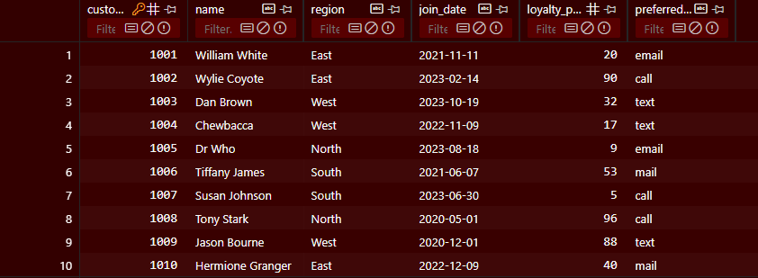

**products**

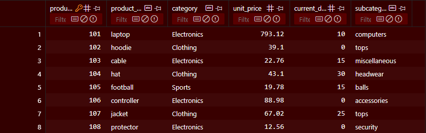

**sales**

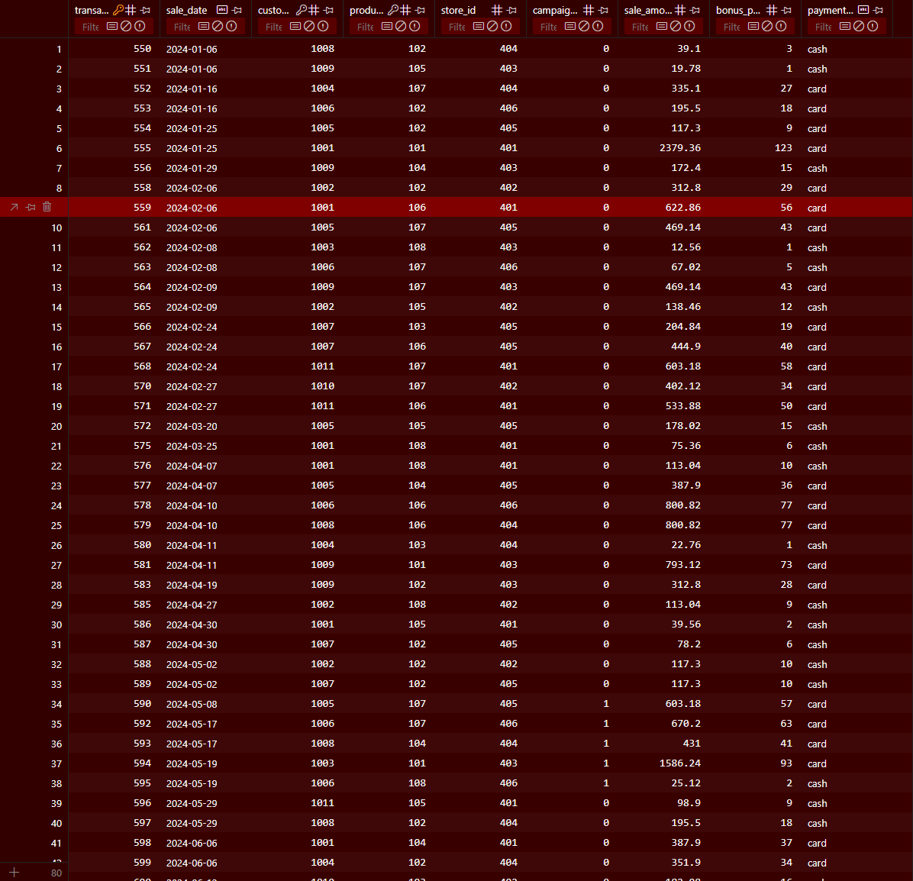

## SQL Queries and Reports

### Queries

There is only one SQL query at the moment, it is used to figure out the top paying customers:

```shell
SELECT c.name, SUM(s.sale_amount) AS total_spent
FROM sale s
JOIN customer c ON s.customer_id = c.customer_id
GROUP BY c.name
ORDER BY total_spent DESC
```

### Reports

For our query a new table titled 'Top Customers' was created where now we can see the total amount of money spent by each customer.

## Power BI Dashboard

### Query Results

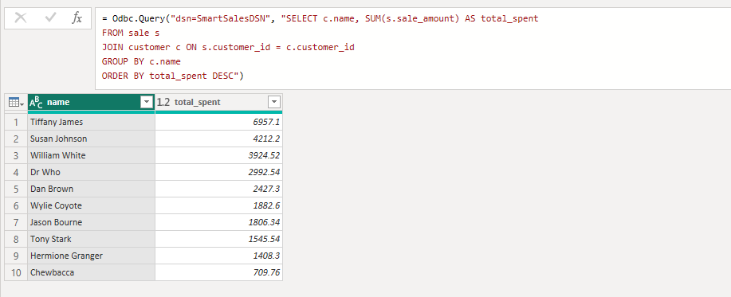

### Model View

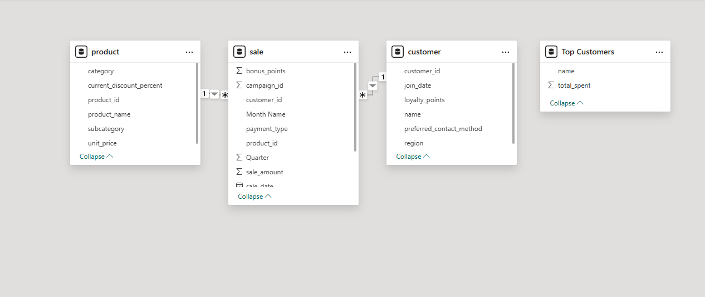

### Dashboard Design

For the final dashboard, there are two slicers on the left-hand side for analyzing more specific data

The rest of the dashboard contains four graphs/charts.

One bar chart shows how much each payment type spent.

The other bar chart shows how much each customer spent.

The line graph shows the sales over time.

Finally, the chart shows all the categories and subcategories of the products sold.

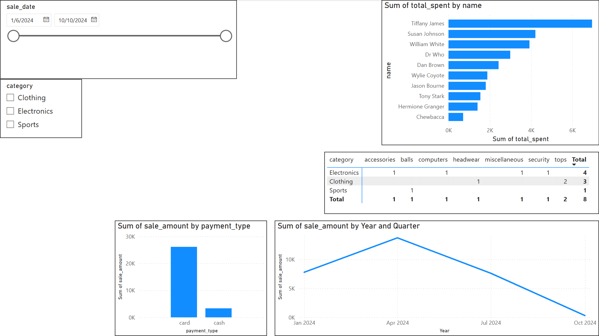

Each chart/slicer/graph contains an outline to help visualize what data belongs where, and the slicers were purposefully kept away from the graphs/charts.

## OLAP Project

### Section 1. The Business Goal

Three goals were put in mind when creating this project.
1. The total sales by month and product
2. The total sales by region
3. The sales by each customer on each product

These goals were choosen because they can help in terms of Data-Driven Decision Making.  Each one of these goals gives insight that can help us understand what these stores need to change in order to do better.

### Section 2. Data Source

For each goal, the information that we started with was 
1. Pre-computed cube
2. Data warehouse
3. Pre-computed cube

The columns that were used from each source were as follows:
1. Month, product_id, sale_amount_sum
2. Region, sale_amount
3. customer_id, product_id, sale_amount_sum

### Section 3. Tools

Python was the tool used for this OLAP Project.  I have a familiarity with Python and I assumed that creating and using the cube would be easiest in code.  I would be very interested in redoing this project using a more drag-and-drop tool like PowerBI just to note the differences.

### Section 4. Workflow and Logic

With regards to workflow, the olap_cubing.py script was used to create our multidimensional olap cube.  When the cube wasn't used for analysis, the database was.  
The data was then filtered, grouped, and visualized to help complete the goals.

**Dimensions:**
- Region
- Month
- CustomerID
- ProductID

**Metrics and Aggregations:**
- Sum of sale_amount

### Section 5. Results

**Goal 1. The total sales by month and product**

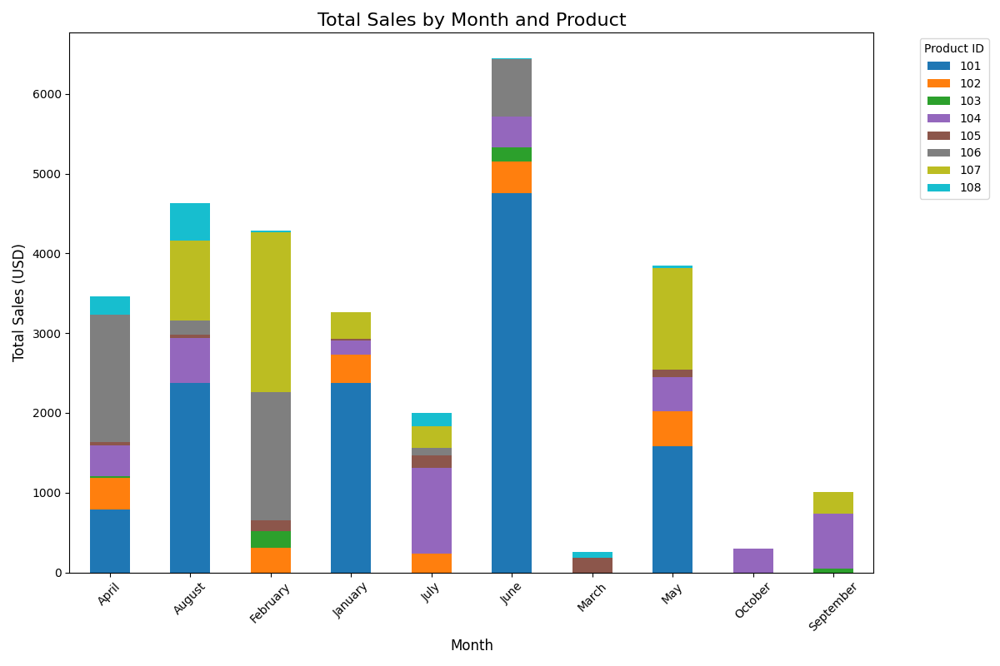

From our visual, we can see that there is a deficit in purchases in the Months of March, September, and October.  Opposite that, June is the best month in terms of revenue.  Product 101 takes the cake as the product that brought in the most sales, followed by product 107.

**Goal 2. The total sales by region**

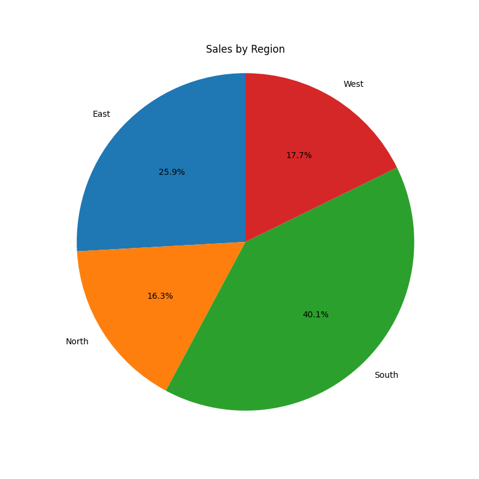

From this pie chart, we can see how much each region contributed to the total sales.  From most to least sales, our regions are south, east, west, north.

**Goal 3. The sales by each customer on each product**

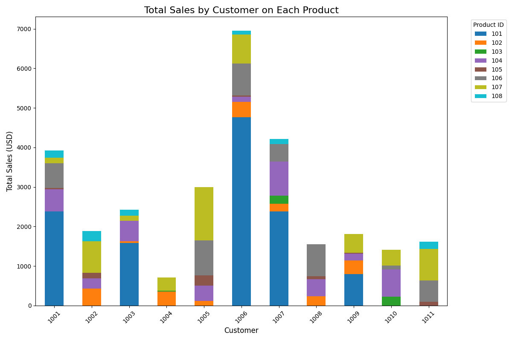

Here we can see how each customer personally contributed to the total sales.  The bar graph is similar to the graph from goal 1, but it does show different information.  We can see that customers 1006 and 1004 stand out as they are the most sales and least sales customers respectively.  When looking at products, we are reinforced from goal 1 that product 101 is the product that brings in the most sales.

### Section 6. Suggested Business Action

**Goal 1.**

From goal 1, the stores should make use of the information that June brings in the most sales.  Knowing this, the stores should have special sales during June because there will be people already in the stores, so these sales would influence them to make impulse buys to further increase revenue.  As for the dead months (March, September, October), a better campaign would be needed.  It is clear that the stores are getting very little action during these months so we need something to get people to the stores.  If that doesn't work then order less inventory for those months to cut expenses.

**Goal 2.**

In the South region, we want to implement sales and maybe even have more inventory available as nearly half of total sales come from the south.  Having said that, it would be nice to increase the sales in the other regions through advertisements or deals people can't pass up.

**Goal 3.**

With goal 3, we get more personal.  Knowing what product each customer buys can help us as we can create personalized offers for them.  Creating these offers shouldn't add a lot of expenses so it should be done for every customer rather than focusing on the customers who contribute the most sales.  Ideally we'd like more sales from every customer.

### Section 7. Challenges

The greatest challenge with this project was learning the cube.  I had to take a lot of time to deeply go through the olap_cubing.py script to fully understand what it does and how it creates the cube.  Then, it took a while to understand how to use the cube.  I'm not sure how much in the real world businesses will tell you goals, but I also had some trouble with creating goals.  I thankfully had a github repo full of examples to choose from.

## Final Custom BI Project

### Section 1. The Business Goal

The business goal for my final project is to **analyze sales trends by region over time**.  This goal can help businesses realize what products do better at what locations as well as how frequently sales are made and how much profit is being brought in.

### Section 2. Data Source

A data warehouse was used as the data source for this project.  Numerous columns were used, including sale_amount, region, category, subcategory, unit_price, sale_date, and payment_type.

### Section 3. Tools Used

For this project, Power BI was the tool used to create aggregations and visualizations.  Although the data warehouse was created in Python, Power BI did the rest.  Power BI was chosen as I find it easier to work with when creating good visuals than using a tool that is code-based.

### Section 4. Workflow and Logic

As mentioned, the data warehouse was done in Python, specifically, the etl_to_dw.py script.  After loading the data via ODBC in Power BI, the first thing was to aggregate the data.  I added a third table, named regions, that simply shows each region and the amount of sale associated with it.  Then multiple visuals were created to generate insights that would possibly help lead us to our goal.

**Dimensions:**
- Region
- Category
- Subcategory
- Sale Date
- Unit Price
- Payment Type

**Metrics and Aggregations:**
- Sum of Sale Amount

### Section 5. Results

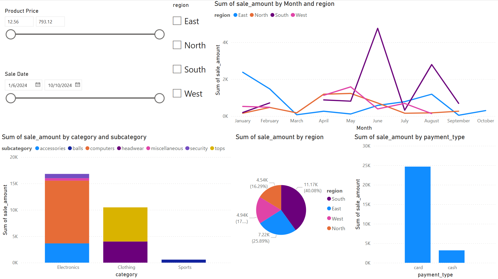

In our final visual created with Power BI, we have three slicers: one to control the data, one to control the price of products, and one to select region(s).  The line chart gives us a look at the sale amount of each region over time, the pie chart shows us how much each region contributed to the total sales, the stacked bar chart shows us the categories and subcategories that made the most profit, and the last bar chart shows how much of the sales came from cash or card.  The line charts have gaps because there were regions that didn't have a single sale in certain months.  Ideally, there would be data for every month but not everything works out the way we want it to.

To give an example of how the slicers contribute, here is a dashboard where we compare the East and South regions while focusing on sales after May 1st with products costing less than $500.  

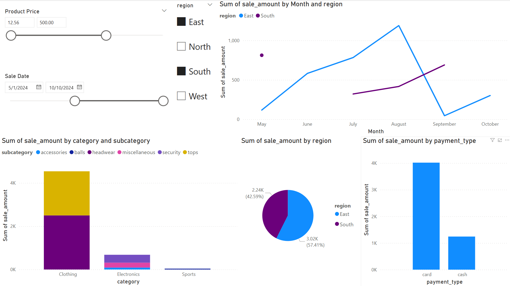

### Section 6. Suggested Business Action

Based on the data from the dashboard we know that the south region was the one that contributed the most to total sales.  Knowing this, it would be best to have regional marketing done.  In the south, spending money on marketing seems like it would pay off, as for the other regions, we would only do marketing during their busy months (January for east, May for north and west).  We also learned that cash is rarely used, so there should be incentives created for cash-only purchases.  This would help us as we wouldn't have to pay to use card transactions as frequently.  Some incentives might be discounts for cash-only purhcases or even cash-back bonuses.

In terms of categories and subcategories, sports is not doing great.  It may be for the best to stop offering these sports items to focus on the electronics and clothing that are making much more profit.  Lastly, when considering the price of the products offered, the majority of products purchased were all less than $100.  Although we do offer products that are more than $100, they are rarely purchased.  Knowing that, we should put discounts and/or deals on our more expensive products to get more cash-flow going with them.

### Section 7. Challenges

The largest challenge I faced while creating this project was figuring out what dimensions and aggregations to used.  Once I got my business goal, I had to brainstorm for a while to figure out what exactly would be helpful.  Knowing region and sale_amount was a given, but I wanted to breach further, to get into real insights rather than face-value.  I also struggled with how to format my dashboard.  The last dashboard I created had awkward empty space, and I didn't want that to happen again, so this time I had to take a bit more time in designing where everything was going.  I knew I wanted all my slicers to be together and that the line graph was going to be the largest graph because I feel that it is the most helpful visual.

### Section 8. Ethical Considerations

I did previously mention that this data is a little incomplete as there were months were there wasn't a single sale in certain regions.  It would be for the best to gather more sale data to have a line chart without any missing pieces.  It would be unethical to make a number of business decisions off of incomplete data.  

The data itself is being used responsibly, it is solely being used for the business goal, nothing unnecessary was created with it.  The only bias that this analysis could reinforce would most likely be regional.  For instance the north region genereated the least amount to total sales of all the regions, so some might see that and have it reinforce an idea that people from the north region are poor or stingy.  The opposite could be said about the south, that they're rich and greedy.  It would be for the best for businesses to know if biases like this exist in the areas that they work in.